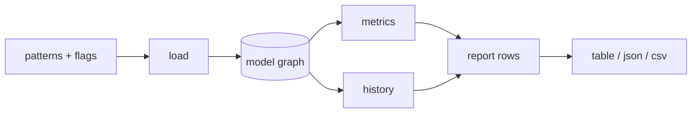
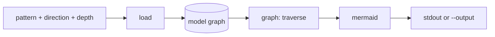

# Architecture

Coarse architecture of `go-depend`. Records the structure and the decisions
behind it. Type signatures and function names are deliberately absent — the
code is the source of truth for those.

Background on the metrics: [fundamentals.md](./fundamentals.md).
Feature scope: [../README.md](../README.md).

## Package Layout

```
main.go
cmd/      cobra commands: root, scan, graph
model/    package, edge, metric and report types
load/     go/packages -> model, --exclude, module classification
metrics/  I, A, D, invariant violations
history/  git log -> perceived instability
graph/    traversal + mermaid rendering
report/   table | json | csv rendering
```

```mermaid
graph TD
    main[main.go] --> cmd
    cmd --> load
    cmd --> metrics
    cmd --> history
    cmd --> graph
    cmd --> report
    load --> model
    metrics --> model
    history --> model
    graph --> model
    report --> model
    report --> metrics
    load --> pkgs[golang.org/x/tools/go/packages]
    history --> git[git binary]
    cmd --> cobra[github.com/spf13/cobra]
```

All dependencies point towards `model`. `model` imports nothing from the
module, which makes it stable but not abstract; the leaf packages fan out from
it and only `cmd` composes them. Cycles are structurally impossible. The
measured consequence is in [baseline.md](./baseline.md): `model` is in the
zone of pain, and the violation is accepted on purpose.

All packages sit in the module root, with no `internal` directory. They are
therefore part of the module's public API, and a change to one of them is a
change other modules can notice.

## Responsibilities

- **model** — the shared vocabulary: a package with its import path, module,
  file set, declaration counts and classified imports; an edge between two
  packages; the computed metrics; the report rows. No behaviour beyond
  trivial accessors.
- **load** — resolves patterns via `go/packages`, applies `--exclude` before
  parsing, counts the exported named types and package-level funcs per package
  and marks the abstract ones, and classifies every import as same-module,
  workspace-sibling, external or stdlib. Finds the implementation edges with
  `types.Implements`. Produces a complete `model` graph. The only package that
  knows about ASTs.
- **metrics** — pure arithmetic over the `model` graph: afferent and efferent
  coupling, `I`, `A = abstract / (types + funcs)` with `A = 0` for an empty
  denominator, the abstract coupling `A_edge`, `D`, and the invariant checks.
  No I/O.
- **history** — runs one `git log --name-status -M --pretty=tformat:%x00%ct`
  subprocess, resolves
  rename chains to the current paths, maps changed files to packages by
  directory, and derives perceived instability per package.
- **graph** — traverses the `model` graph in the requested directions to the
  requested depth, follows the imports or the implementation edges or both,
  and renders mermaid.
- **report** — renders report rows as an aligned text table, JSON or CSV.
- **cmd** — cobra command definitions, flag parsing, and the wiring that
  turns flags into calls on the packages above. Owns the exit code.

## Data Flow

### `go-depend scan [pattern ...]`



`load` runs once and produces the whole graph; `metrics` and `history` are
independent consumers of it. `history` runs only with `--history`. `cmd`
merges both result sets into report rows, sorts by module then package name,
and hands them to the selected renderer. Exit code is 1 if
`--fail-on-violation` is set and any row carries a violation, 2 on tool or
usage errors, 0 otherwise.

### `go-depend graph [pattern]`



The three focus modes from the README are flag combinations, not code paths:

| README mode | Invocation |
|---|---|
| whole application from `main` | `graph ./cmd/app --outgoing --depth 0` |
| neighbourhood of a package | `graph ./metrics` (the default) |
| fan-in of an external package | `graph github.com/x/y --incoming --depth 0` |

Nodes are always restricted to packages of the module. In a workspace each
module renders as its own mermaid subgraph, so cross-module edges stay
visible even though they do not feed `I`.

## Decisions

| Decision | Rationale |
|---|---|
| `golang.org/x/tools/go/packages` as the only loader | `go list` pattern semantics, ASTs and type info in one pass; type info makes generics detection reliable |
| `I` counts module-internal coupling only | matches [fundamentals.md](./fundamentals.md), keeps `Ce`/`Ca` symmetric — `Ca` is unobservable outside the module |
| stdlib and external dependency counts are separate columns | satisfies the README's outgoing-dependency bullet without distorting `I` |
| `A` counts exported named types and package-level funcs | abstract = interfaces + type-parameterised types + type-parameterised funcs; methods, consts, vars and type aliases are ignored — Martin counts classes, not members, and counting methods drives `A` toward 0 for any type with a handful of methods |
| `I = 1` if `Ce + Ca = 0` | a package without any coupling inside its module can be changed freely, which is what `I = 1` states; `I = 0` would put it at `A + I - 1 = -1` and flag every isolated package as the zone of pain |
| `A = 0` if the denominator is 0 | no exported surface means no abstraction; a `main` package then lands at `A + I - 1 = 0`, on the main sequence, so no third state is needed in the renderers or the checks |
| `A` over exported declarations only | `A` describes the package's contract towards its dependents; unexported internals are invisible to them, so `A` stays stable under internal refactoring |
| tests excluded (`Tests: false`) | test-only imports (testify, mocks, package under test) would inflate `Ce` for every well-tested package |
| direct imports only for `Ce`/`Ca` | transitivity is a graph-traversal concern, not a coupling metric |
| reality check is `scan --history`, not a command | the perceived instability is read next to `I`, so it belongs in the table that already holds `I` |
| the history uses the commit date, not the author date | `git log --since` compares against the commit date; with the author date the limit of the window and the dates of the changes would disagree, and the oldest bucket of the perceived instability would be wrong |
| rename-aware history via `git log --name-status -M` | a moved package would otherwise appear as two short-lived packages and produce a false mismatch against `I`; `git mv` is common, and the rename lines arrive from the same subprocess and the same parse loop |
| `git log` subprocess instead of go-git | no dependency tree, faster on large histories, honours the user's existing git configuration |
| the window of the history reaches from the oldest to the newest change, not until today | the result of the reality check must not change just because the tool runs a month later; a repository that nobody touched keeps its numbers |
| a change of a test file is no change of the package | consistent with the calculated metrics, which ignore test files completely; only `*.go` files that are no `_test.go` count |
| `git log --relative` | the paths of the changes must be relative to the module, otherwise a module in a subdirectory of a repository matches no package at all |
| `perceived_I` = active buckets / total buckets | encodes both README heuristics (constant change → 1.0, burst-then-quiet → low), lands natively on 0..1, and is recomputable by hand |
| the perceived instability is reported next to `I`, and never subtracted from it | `I` counts imports, the perceived instability counts months; both happen to end up between 0 and 1, but their difference has no meaning. The reader compares the two columns |
| stable dependencies checked per edge | names the offending import instead of averaging it away; an average hides one bad edge among many good ones |
| stable abstractions and zones collapse into one signed `D` check | "stable but concrete" *is* the zone of pain; two predicates that always agree are one predicate |
| `--max-distance`, default 0.5 | the only genuinely taste-dependent threshold; a CI adopter must be able to ratchet it |
| one arrow per pair of packages for the implementations, with the number of interfaces as its label | five interfaces between the same two packages are five arrows that say the same thing; in ctt one pair alone has five |
| composable `--incoming` / `--outgoing` / `--depth` | two orthogonal knobs instead of three presets; answers questions not yet asked |
| `--exclude` matches module-relative file paths, before parsing | excluded generated files must contribute neither declarations nor imports; a per-function filter could change `A` but never `Ce`, which is inconsistent |
| table, JSON and CSV renderers | JSON for pipelines, CSV for architecture reviews; the report row type is the shared contract |
| `--fail-on-violation` opts into exit 1 | interactive runs on real codebases must not look like failures |
| `go.work` supported, each module its own universe | cross-module imports count as external, matching the same-module definition of `I`; adding a module to the workspace must not change another module's numbers |
| a package is shown by its path relative to its module, together with a `MODULE` column as soon as the report covers more than one module | the module column resolves the only ambiguous case, two modules that share a directory prefix; without it a nested module would show the same relative path twice |
| the violation of `model` is accepted for this module | `model` holds the shared vocabulary as plain data types; interfaces instead of data would make every other package harder to read for the sake of one number, see [baseline.md](./baseline.md) |
| the abstract coupling asks the dependent packages, and not the package itself | in Go an interface belongs to the package that uses it, and a type implements it without a reference: `A` asks a question that the package cannot answer |
| a call of a method through an interface counts as an abstract use | the caller uses the abstraction and not one of its implementations; without this rule a package that only calls interface methods would look concrete |
| every used symbol counts one time, however often the code uses it | a structure inside a loop must not control the result |
| an implementation edge connects a type with an interface of another package | Go satisfies an interface implicitly, therefore this dependency exists without any import; in ctt there are 16 such edges against 11 import edges, and none of them is visible in the import graph |
| every structural match is an implementation edge, without any filter | measured against four code bases: a filter that needs an import removes 81% of the edges of ctt, a filter that needs two methods removes 68% of the edges of hellocontest, and both remove real ports; the measured noise stays below 9%, see [baseline.md](./baseline.md) |
| an interface is no implementation of another interface | an interface that contains all methods of another interface describes the same abstraction, it does not implement it |
| a generic type takes part in an edge, and a generic interface takes part through the instantiations that the module really uses | an interface with type parameters has no method set that a type can implement; the instantiations come from `TypesInfo.Instances`, and only those with concrete type arguments count |
| layered around `model` | one job per package, one direction of dependency, and a layout that scores honestly under the tool's own metrics |

## Open Points

- **A generic type that implements a generic port stays invisible.**
  Iteration 20 finds a generic port through its instantiations, which is
  enough for a module that mixes generic and concrete code. It is not enough
  for a module that is generic from the top to the bottom: there the relation
  is between `Pipeline[S,F]` and `Listener[F]`, and `types.Implements` cannot
  compare two generic declarations, because their type parameters are
  different objects. A comparison of that kind needs unification.
  Consequence: the abstract coupling of sdrainer is not trustworthy, see
  [baseline.md](./baseline.md).
- **An accidental match is not recognized.** `clock.Controller` implements
  `logbook.QSOView` only because both declare a method `Show()`. The exact
  test is different: does the program pass a value of the type where the
  interface is expected? `TypesInfo` from iteration 18 makes this test
  possible, with a walk over the assignments, the calls and the returns.
- **`graph` always analyzes the module with `./...`.** The command resolves
  its argument to a single root with a metadata-only load, and then loads the
  module with the cwd-relative pattern `./...`. In a subdirectory of the
  module this leaves packages out, and the incoming imports of the root are
  then incomplete. The command help says to run it in the root directory of
  the module; a check or a cwd-independent module pattern is still missing.
- **Metrics on a subset of a module are incomplete.** A narrow pattern leaves
  packages out of the graph, and both the afferent coupling and the
  stable-dependencies check depend on packages that may be missing. `scan`
  therefore defaults to `./...`, but a warning for a pattern that covers only
  a part of a module is still missing.
- **The bucket size is fixed to one month, without evidence.** A repository
  with a short history has very few buckets, and the perceived instability
  then jumps in large steps. The repository of go-depend has one single
  commit, so its own reality check reports 1.00 for every package, see
  [baseline.md](./baseline.md). Revisit the bucket size, and the need for a
  flag, after the first run against a long history.
- **A history that is too short is not reported.** With only a few buckets the
  perceived instability can only be 0 or 1. `scan --history` should say so
  instead of presenting a number that carries no information.
