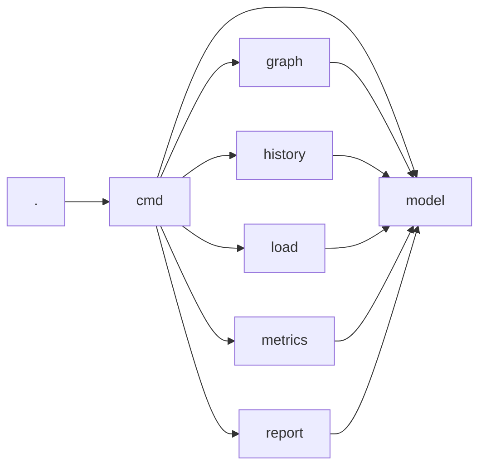
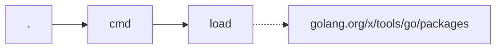

# Baseline

go-depend measured on its own code. Recorded on 2026-09-04, after iteration 13
of [plan.md](./plan.md). The numbers are the evidence for the decisions in
[architecture.md](./architecture.md), and they are the reference for the
changes that come after.

## Metrics

```
go-depend scan
```

```
PACKAGE  CA  CE  STD  EXT  I     A     D     ZONE  SDP
.        0   1   3    0    1.00  0.00  0.00  -     -
cmd      1   6   5    1    0.86  0.00  0.14  -     -
graph    1   1   5    0    0.50  0.00  0.50  -     -
history  1   1   9    0    0.50  0.00  0.50  -     -
load     1   1   9    1    0.50  0.00  0.50  -     -
metrics  1   1   1    0    0.50  0.00  0.50  -     -
model    6   0   3    0    0.00  0.00  1.00  PAIN  -
report   1   1   9    0    0.50  0.00  0.50  -     -

Violations:
  github.com/ftl/go-depend/model: zone of pain, D=1.00
```

`scan --fail-on-violation` exits with the code 1 because of this one
violation.

### What the numbers say

- **No package contains an abstraction.** `A=0.00` everywhere: the module has
  no exported interface and no exported generic type or function. This is not
  a defect of the measurement, it is the design: the packages are connected by
  direct calls and by plain data types.
- **`model` is in the zone of pain.** Six of eight packages depend on it, and
  it is completely concrete. Every change of `model.Package` or
  `model.Metrics` reaches all of them.
- **The invariant about stable dependencies is not violated.** The
  instability decreases along every import inside the module, from `cmd`
  through the leaf packages to `model`.
- **`cmd` has the highest efferent coupling**, `Ce=6`, which is expected: it
  is the only package that composes the others.

### The violation of `model` is accepted

`model` holds the shared vocabulary of the module: `Package`, `Import`,
`Graph` and `Metrics`. To leave the zone of pain, it would have to become
abstract, which means interfaces instead of data types. Data behind an
interface is not idiomatic Go, and it would make every other package harder to
read for the sake of one number.

The metric is right about the consequence: a change of `model` affects six
packages. The answer is to keep `model` small and to change it rarely, not to
hide it behind abstractions.

The claim in [architecture.md](./architecture.md) that `model` is "stable and
abstract" was wrong and is corrected: `model` is stable and concrete.

## Dependency Graph

```
go-depend graph . --outgoing --depth 0
```



The graph shows the layout that [architecture.md](./architecture.md)
describes: every dependency points towards `model`, and only `cmd` composes
the other packages. There is no cycle, and no leaf package knows another leaf
package.

```
go-depend graph golang.org/x/tools/go/packages --incoming --depth 0
```



Only `load` uses `go/packages`, and the dotted arrow marks the import that
leaves the module. The most expensive dependency of go-depend is contained in
one package.

## The Experiment with the Efferent Coupling

To be sure about the definition of `I`, the metrics were calculated a second
time with the standard library and the external packages included in `Ce`.
`I*` and `D*` are the results of that variant:

| PACKAGE | CA | CE | STD | EXT | A | I | D | I* | D* |
|---|---|---|---|---|---|---|---|---|---|
| . | 0 | 1 | 3 | 0 | 0 | 1.00 | 0.00 | 1.00 | 0.00 |
| cmd | 1 | 6 | 5 | 1 | 0 | 0.86 | 0.14 | 0.92 | 0.08 |
| graph | 1 | 1 | 5 | 0 | 0 | 0.50 | 0.50 | 0.86 | 0.14 |
| history | 1 | 1 | 9 | 0 | 0 | 0.50 | 0.50 | 0.91 | 0.09 |
| load | 1 | 1 | 9 | 1 | 0 | 0.50 | 0.50 | 0.92 | 0.08 |
| metrics | 1 | 1 | 1 | 0 | 0 | 0.50 | 0.50 | 0.67 | 0.33 |
| model | 6 | 0 | 3 | 0 | 0 | 0.00 | 1.00 | 0.33 | 0.67 |
| report | 1 | 1 | 9 | 0 | 0 | 0.50 | 0.50 | 0.91 | 0.09 |

The variant was rejected for three reasons:

- **It flattens the result.** With `A=0` the distance becomes
  `D* = Ca / (Ce + STD + EXT + Ca)`. Six of eight packages land between 0.08
  and 0.14, and the report no longer separates them.
- **It rewards the use of the standard library.** `history` reaches `D*=0.09`
  because it imports nine packages of the standard library. If it used fewer
  of them, its value would get worse.
- **It can invent violations.** `I*` grows with the number of imports of the
  standard library. A leaf package that uses many of them looks less stable
  than the package that imports it, which the check for stable dependencies
  then reports as a violation.

`model` stays in the zone of pain in both variants: `A=0` is the reason, not
the definition of `Ce`.

## The Reality Check Is Not Measured Here

The directory of go-depend is no git repository, therefore
`scan --history` cannot run against it:

```
go-depend: cannot read the git history: fatal: not a git repository (or any of the parent directories): .git
```

The reality check is covered by tests against generated repositories, but it
has never run against a real history. The bucket size of one month is
therefore still a guess.
