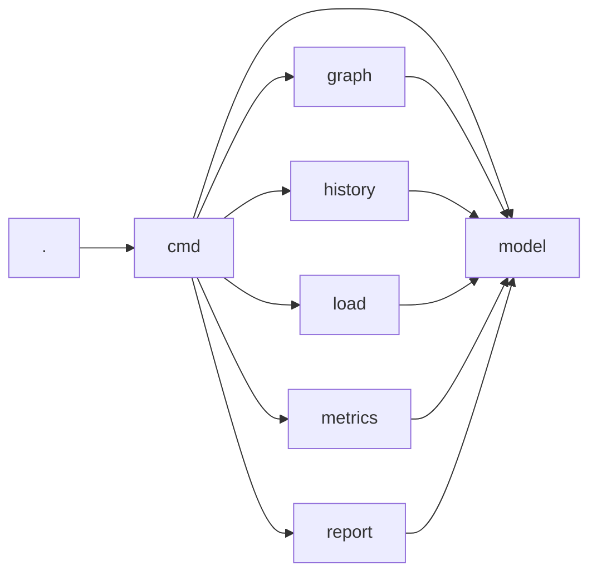
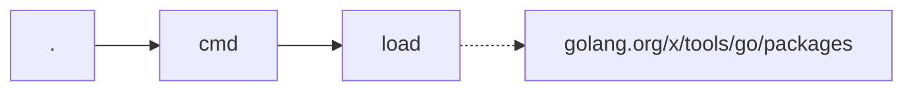

# Baseline

go-depend measured on its own code. Recorded on 2026-09-04, after iteration 13
of [plan.md](./plan.md). The numbers are the evidence for the decisions in
[architecture.md](./architecture.md), and they are the reference for the
changes that come after.

## Metrics

```
go-depend scan
```

```
PACKAGE  CA  CE  STD  EXT  I     A     D     ZONE  SDP
.        0   1   3    0    1.00  0.00  0.00  -     -
cmd      1   6   5    1    0.86  0.00  0.14  -     -
graph    1   1   5    0    0.50  0.00  0.50  -     -
history  1   1   9    0    0.50  0.00  0.50  -     -
load     1   1   9    1    0.50  0.00  0.50  -     -
metrics  1   1   1    0    0.50  0.00  0.50  -     -
model    6   0   3    0    0.00  0.00  1.00  PAIN  -
report   1   1   9    0    0.50  0.00  0.50  -     -

Violations:
  github.com/ftl/go-depend/model: zone of pain, D=1.00
```

`scan --fail-on-violation` exits with the code 1 because of this one
violation.

### What the numbers say

- **No package contains an abstraction.** `A=0.00` everywhere: the module has
  no exported interface and no exported generic type or function. This is not
  a defect of the measurement, it is the design: the packages are connected by
  direct calls and by plain data types.
- **`model` is in the zone of pain.** Six of eight packages depend on it, and
  it is completely concrete. Every change of `model.Package` or
  `model.Metrics` reaches all of them.
- **The invariant about stable dependencies is not violated.** The
  instability decreases along every import inside the module, from `cmd`
  through the leaf packages to `model`.
- **`cmd` has the highest efferent coupling**, `Ce=6`, which is expected: it
  is the only package that composes the others.

### The violation of `model` is accepted

`model` holds the shared vocabulary of the module: `Package`, `Import`,
`Graph` and `Metrics`. To leave the zone of pain, it would have to become
abstract, which means interfaces instead of data types. Data behind an
interface is not idiomatic Go, and it would make every other package harder to
read for the sake of one number.

The metric is right about the consequence: a change of `model` affects six
packages. The answer is to keep `model` small and to change it rarely, not to
hide it behind abstractions.

The claim in [architecture.md](./architecture.md) that `model` is "stable and
abstract" was wrong and is corrected: `model` is stable and concrete.

## Dependency Graph

```
go-depend graph . --outgoing --depth 0
```



The graph shows the layout that [architecture.md](./architecture.md)
describes: every dependency points towards `model`, and only `cmd` composes
the other packages. There is no cycle, and no leaf package knows another leaf
package.

```
go-depend graph golang.org/x/tools/go/packages --incoming --depth 0
```



Only `load` uses `go/packages`, and the dotted arrow marks the import that
leaves the module. The most expensive dependency of go-depend is contained in
one package.

## The Experiment with the Efferent Coupling

To be sure about the definition of `I`, the metrics were calculated a second
time with the standard library and the external packages included in `Ce`.
`I*` and `D*` are the results of that variant:

| PACKAGE | CA | CE | STD | EXT | A | I | D | I* | D* |
|---|---|---|---|---|---|---|---|---|---|
| . | 0 | 1 | 3 | 0 | 0 | 1.00 | 0.00 | 1.00 | 0.00 |
| cmd | 1 | 6 | 5 | 1 | 0 | 0.86 | 0.14 | 0.92 | 0.08 |
| graph | 1 | 1 | 5 | 0 | 0 | 0.50 | 0.50 | 0.86 | 0.14 |
| history | 1 | 1 | 9 | 0 | 0 | 0.50 | 0.50 | 0.91 | 0.09 |
| load | 1 | 1 | 9 | 1 | 0 | 0.50 | 0.50 | 0.92 | 0.08 |
| metrics | 1 | 1 | 1 | 0 | 0 | 0.50 | 0.50 | 0.67 | 0.33 |
| model | 6 | 0 | 3 | 0 | 0 | 0.00 | 1.00 | 0.33 | 0.67 |
| report | 1 | 1 | 9 | 0 | 0 | 0.50 | 0.50 | 0.91 | 0.09 |

The variant was rejected for three reasons:

- **It flattens the result.** With `A=0` the distance becomes
  `D* = Ca / (Ce + STD + EXT + Ca)`. Six of eight packages land between 0.08
  and 0.14, and the report no longer separates them.
- **It rewards the use of the standard library.** `history` reaches `D*=0.09`
  because it imports nine packages of the standard library. If it used fewer
  of them, its value would get worse.
- **It can invent violations.** `I*` grows with the number of imports of the
  standard library. A leaf package that uses many of them looks less stable
  than the package that imports it, which the check for stable dependencies
  then reports as a violation.

`model` stays in the zone of pain in both variants: `A=0` is the reason, not
the definition of `Ce`.

## The Implementation Edges

Iteration 15 finds the types that implement an interface of another package.
Go satisfies an interface implicitly, therefore these dependencies exist
without any import. Iteration 16 measured them, to decide how an accidental
match must be treated.

| project | packages | import edges | implementation edges | with an import | interface with one method |
|---|---|---|---|---|---|
| go-depend | 8 | 11 | 0 | 0 | 0 |
| ctt | 7 | 11 | 16 | 3 | 8 |
| sdrainer | 22 | 30 | 1 | 1 | 0 |
| hellocontest | 42 | 115 | 168 | 40 | 115 |

### The two planned filters both remove more signal than noise

**A filter that needs an import** removes 81% of the edges of ctt and 76% of
the edges of hellocontest. It removes exactly the design that the metric must
find:

```
ctt/pkg/corpus.RandomCorpus  implements  ctt/pkg/trainer.Corpus
```

`corpus` imports `trainer` nowhere. This is a complete inversion, and the
filter would delete it.

**A filter that needs two methods or more** removes 68% of the edges of
hellocontest. Its interfaces are the listeners of the Go idiom, and a listener
has one method:

```
core/entry.Controller  implements  core/settings.StationListener
core/callinfo.Callinfo implements  core/logbook.ScoreChangedListener
```

### The noise is real, but small

An accidental match needs the same method name and the same signature. The
names of the one-method interfaces are almost all names of the domain:
`ContestChanged`, `ScoreChanged`, `VFOModeChanged`, `StationChanged`.

Some names are general enough for an accident, and one is proven:

```
core/logbook.QSOView   is   interface { Show() }
core/clock.Controller  has  a method Show(), for its own view
core/bandmap.Bandmap   has  a method Show(), for its own window
```

Both are reported as implementations of `QSOView`, and both are wrong.

Of the 123 edges with a one-method interface, 26 have a general method name
(`Show`, `Now`, `Find`, `Add`, `Play`), and 17 of these have no import. This
is the upper limit of the noise: **approximately 9% of all edges**.

### The generic ports, and what iteration 20 recovered

`sdrainer` produced a single implementation edge, although it declares 18
interfaces. Its ports carry type parameters, for example
`IQRecorder[S dsp.Number]`, and an interface with type parameters has no
method set that a type can implement.

Iteration 20 added the instantiations that a module really uses, from
`TypesInfo.Instances`. The result:

| project | before | after |
|---|---|---|
| go-depend | 0 | 0 |
| ctt | 16 | 16 |
| sdrainer | 1 | 2 |
| hellocontest | 168 | 168 |

The mechanism works: in the fixture `adapter.Box` implements
`port.Store[string]` as soon as the package `wired` names that instantiation.
sdrainer wins one single edge, `tci.Process implements core.ChannelService[int]`.

The reason for the small win is the structure of sdrainer: it is generic from
the top to the bottom. The concrete instantiation happens only in the package
that connects the parts, and the interesting relation is between two generic
declarations, for example `pipeline.Pipeline[S,F]` and
`core.ChannelReceiveListener[F]`. `types.Implements` cannot compare these two:
the type parameters of the two declarations are different objects. A
comparison of that kind needs unification, and go/types does not offer it.

Six packages of sdrainer still have `A>0.5` and `A_edge=0`: `dsp`, `multirx`,
`notify`, `pipeline`, `pipeline/generator` and `scope`. For a module that is
generic from the top to the bottom, the abstract coupling stays blind.

## `A` and the Abstract Coupling

Iteration 18 added the abstract coupling `A_edge`. It asks the dependent
packages how they use a package, instead of asking the package how abstract it
is. Iteration 19 compared both values over four code bases.

| project | packages | mean `A` | mean `A_edge` | packages with `A>0` | packages with `A_edge>0` |
|---|---|---|---|---|---|
| go-depend | 8 | 0.00 | 0.00 | 0 | 0 |
| ctt | 7 | 0.22 | 0.23 | 3 | 3 |
| sdrainer | 22 | 0.31 | 0.09 | 11 | 7 |
| hellocontest | 42 | 0.27 | 0.20 | 25 | 23 |

Where both values work, they agree: 6 of 7 packages of ctt and 27 of 42
packages of hellocontest stay within 0.15 of each other.

### Where the abstract coupling is better

`hellocontest/core/app` connects all parts of the application. `A` gives it
0.57, and with `I=0.94` it lands in the zone of uselessness: abstract, and
nobody depends on it. This is wrong, and it is the known weakness of `A` for a
package that only declares the interfaces of its parts. `A_edge` gives it
0.03, and the package leaves the zone.

### Where the abstract coupling fails

sdrainer declares its ports with type parameters, and an interface with type
parameters takes part in no implementation edge. The result is a value of 0
for six packages that `A` sees as abstract:

| package | `A` | `A_edge` |
|---|---|---|
| notify | 1.00 | 0.00 |
| pipeline/generator | 1.00 | 0.00 |
| scope | 1.00 | 0.00 |
| pipeline | 0.95 | 0.00 |
| multirx | 0.67 | 0.00 |
| dsp | 0.69 | 0.00 |

`A` is wrong about these packages as well, because it counts generic types as
abstractions. Both values are wrong, for two different reasons, and neither
can be trusted for a module that uses generics this way.

### The distance keeps `A`

If `D` used `A_edge`, five packages of sdrainer would change their zone, four
of them into the zone of pain, only because their ports are generic. A metric
that gates a build must not do that. `A_edge` stays a column of its own until
the implementation of a generic port is found.

Two more observations for that decision:

- The zone changes of ctt and hellocontest are small: `ctt/pkg/trainer` moves
  from the main sequence into the zone of pain because `A` is 0.50 and
  `A_edge` is 0.47, and the threshold is exactly 0.50. That is a difference at
  the limit, not a different verdict.
- No package of hellocontest has `A=0` and `A_edge>0`. The abstract coupling
  finds no abstraction that `A` does not see there. It corrects the value
  where `A` is too generous.

### What the flag `--edge` does to the four code bases

`scan --edge` calculates the distance and the zone with `A_edge` instead of
`A`. Both values stay in the report.

| project | packages | violations with `A` | violations with `A_edge` | mean `D` with `A` | mean `D` with `A_edge` |
|---|---|---|---|---|---|
| go-depend | 8 | 1 | 1 | 0.46 | 0.46 |
| ctt | 7 | 2 | 3 | 0.40 | 0.42 |
| sdrainer | 22 | 4 | 7 | 0.33 | 0.47 |
| hellocontest | 42 | 8 | 9 | 0.35 | 0.36 |

**go-depend does not change.** The module contains no interface, therefore
both values are 0 for every package.

**ctt changes one package, and the change is a border case.**
`pkg/trainer` has `A=0.50` and `A_edge=0.47`, and the limit is exactly 0.50.
`D` moves from 0.50 to 0.53, and the package enters the zone of pain. The two
values agree about the package, only the limit lies between them.

**hellocontest changes three packages, and one of them is the correction that
this story is built for.**

| package | `A` | `A_edge` | `I` | zone with `A` | zone with `A_edge` |
|---|---|---|---|---|---|
| core/app | 0.57 | 0.03 | 0.94 | uselessness | main sequence |
| core/remote | 0.50 | 0.33 | 0.00 | main sequence | pain |
| core/export/cabrillo | 0.20 | 0.11 | 0.33 | main sequence | pain |

`core/app` connects the parts of the application. `A` calls it abstract, and
because no package depends on it, `A` puts it in the zone of uselessness.
`A_edge` corrects this.

`core/remote` declares two interfaces that it uses itself,
`ActionDispatcher` and `Keyer`, and one structure `Server`. Its only dependent
`core/app` uses `remote.Server` and `remote.NewServer`, both concrete. `A`
counts the two ports of the package, `A_edge` counts how the package is really
used. The new zone is correct, but with `Ca=1` it sounds harder than the
situation is.

**sdrainer changes five packages, and four of these changes are the blind
spot and no result.**

| package | `A` | `A_edge` | zone with `A` | zone with `A_edge` |
|---|---|---|---|---|
| dsp | 0.69 | 0.00 | main sequence | pain |
| notify | 1.00 | 0.00 | main sequence | pain |
| pipeline | 0.95 | 0.00 | main sequence | pain |
| core | 0.52 | 0.28 | main sequence | pain |
| scope | 1.00 | 0.00 | uselessness | main sequence |

`dsp`, `notify` and `pipeline` reach `A_edge=0.00` because their ports carry
type parameters and their implementations are generic as well. The mean
distance of the module grows from 0.33 to 0.47: the metric goes dark, the
design does not get worse.

**Conclusion.** `--edge` works for a module with concrete ports, and it gives
one better answer there. For a module that is generic from the top to the
bottom it invents violations. This is the reason for the flag: the user
decides per run which value to trust.

## The Reality Check

```
go-depend scan --history
```

```
PACKAGE  CA  CE  STD  EXT  I     A     D     ZONE  SDP  PERCEIVED
.        0   1   3    0    1.00  0.00  0.00  -     -    1.00
cmd      1   6   5    1    0.86  0.00  0.14  -     -    1.00
graph    1   1   5    0    0.50  0.00  0.50  -     -    1.00
history  1   1   9    0    0.50  0.00  0.50  -     -    1.00
load     1   1   9    1    0.50  0.00  0.50  -     -    1.00
metrics  1   1   1    0    0.50  0.00  0.50  -     -    1.00
model    6   0   3    0    0.00  0.00  1.00  PAIN  -    1.00
report   1   1   9    0    0.50  0.00  0.50  -     -    1.00
```

The result says nothing, and it says so clearly: the repository contains one
single commit. The analyzed history is therefore one month long, every package
changed in that one month, and every package reaches the perceived instability
1.00.

This is the correct result of the definition, and it shows the limit of the
reality check: it needs a history that covers several months. With less than a
handful of buckets the perceived instability can only be 0 or 1, and it says
more about the age of the repository than about the packages.

The bucket size of one month is therefore still a guess, and go-depend does
not yet warn about a history that is too short.
