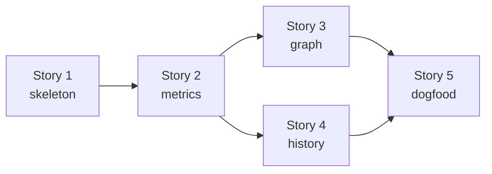
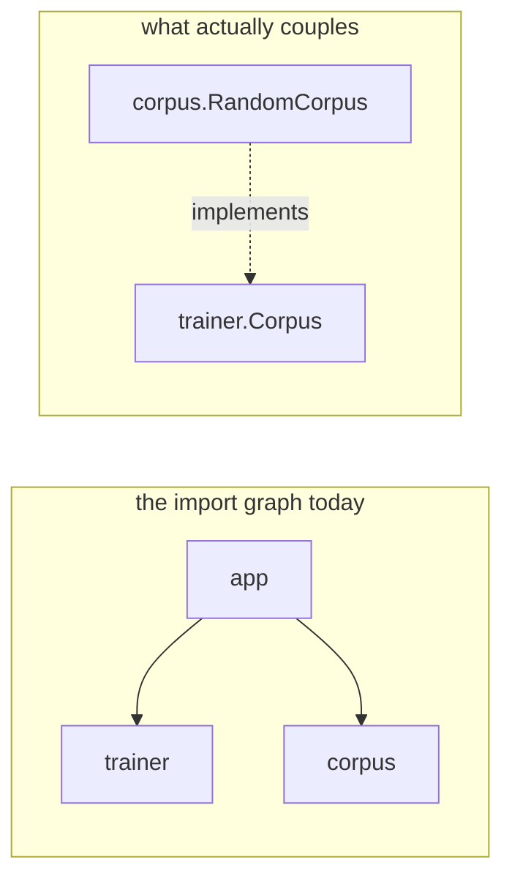

# Implementation Plan

Iterations 1 to 14 are implemented as of 2026-09-04. The measured result is in
[baseline.md](./baseline.md). Story 6 is planned, not implemented.

Iterations for the architecture in [architecture.md](./architecture.md). Each
iteration is self-contained, compiles on its own, and leaves one runnable
check behind. Stories group related iterations.

Testing uses `github.com/stretchr/testify`. Packages that read the file system
or run subprocesses take their input as a `fs.FS` or an `io.Reader` where that
costs nothing, so their tests need neither a real module nor a real repository.



## Story 1 — Walking Skeleton

### Iteration 1: module and root command

- `go.mod` (module path `github.com/ftl/go-depend`, current Go version), `.gitignore` entry for the binary
- `main.go` in the module root: calls `cmd.Execute()`, maps the returned error to an exit code (0 ok, 2 error)
- `cmd`: cobra root command with the long description from the README, no subcommands yet
- **Check**: root command executes and prints help without error
- **Done when**: `go build ./...` and `go-depend --help` work

### Iteration 2: the model

- `model`: package node (import path, module path, directory, exported type/func counts, abstract count), import edge with its classification (same-module, workspace-sibling, external, stdlib), and a graph holding the nodes plus forward and reverse edge lookups
- No behaviour beyond construction and lookup
- **Check**: unit test builds a small graph by hand and asserts forward and reverse lookups, including a package with no edges in either direction
- **Done when**: `metrics`, `graph` and `history` have a vocabulary to be written against

## Story 2 — Metrics and `scan`

### Iteration 3: loading the import graph

- `load`: patterns to `go/packages` (`NeedName|NeedFiles|NeedCompiledGoFiles|NeedModule|NeedSyntax`, `Tests: false`), build the `model` graph, classify every import
- `--exclude` regexes applied to module-relative file paths before parsing; a file list is enough at this stage
- Workspace handling: each package keeps its own module path, cross-module imports classify as external
- Refuse a package with load errors, naming it. Note: unresolved imports and
  type errors only surface once `NeedTypes` is requested, so this guard is
  limited to pattern and list errors until iteration 4
- Testdata: a fixture module under `load/testdata/module` (own `go.mod`, five packages, one generated-looking file), a workspace fixture under `load/testdata/workspace`, and `load/testdata/empty` without any Go file
- **Check**: load the fixture module, assert node set and per-package import classifications
- **Done when**: a full import graph is available for a real directory

### Iteration 4: declaration counting

- `load`: add `NeedTypes`, count exported named types and package-level funcs, mark the abstract ones (interfaces, type-parameterised types, type-parameterised funcs)
- With `NeedTypes` the refusal of packages that do not compile becomes effective; add a fixture module with an unresolved import to cover it
- Ignore methods, consts, vars and type aliases
- Extend the fixture with an interface, a generic type, a generic func, a plain struct, a named non-struct type, methods, consts, vars, an alias, and a package with no exported declarations
- **Check**: per-package expected counts over the fixture, table-driven
- **Done when**: the graph carries everything `A` needs

### Iteration 5: I, A, D

- `metrics`: `Ca`, `Ce` (same-module only), stdlib and external counts, `I`, `A` (`0` for an empty denominator), signed `A + I - 1`, `D`
- **Check**: table-driven tests on hand-built graphs — a leaf, a hub, a `main` package, an empty package, a package with only stdlib imports
- **Done when**: every number in the report exists

### Iteration 6: invariants

- `metrics`: per-edge stable-dependencies check (`I(dep) > I(pkg)`) returning the offending imports, and the zone check on the signed distance against a threshold, yielding none / pain / useless
- **Check**: table-driven tests, including a package with several violating edges and one exactly at the threshold
- **Done when**: violations are computable without any rendering

### Iteration 7: `scan` with the table renderer

- `report`: report row type and the aligned text renderer, sorted by module then package name; violation markers and the offending imports
- `cmd`: `scan` command with `[pattern ...]` (default `./...`), `--exclude`, `--max-distance`
- **Check**: renderer golden test on hand-built rows; command test asserting `scan` on the fixture produces a non-empty table
- **Done when**: the tool is useful end to end for the first time

### Iteration 8: JSON and CSV

- `report`: JSON and CSV renderers over the same row type, `--format table|json|csv`
- **Check**: golden tests for both; JSON round-trips into a map with the expected keys
- **Done when**: output is machine readable

### Iteration 9: exit codes

- `cmd`: `--fail-on-violation` → exit 1 when any row carries a violation; keep 2 for tool and usage errors
- **Check**: command tests for all three exit codes
- **Done when**: `scan` works as a CI gate

## Story 3 — `graph`

### Iteration 10: traversal

- `graph`: breadth-first traversal from the selected packages in the requested directions, depth limit with 0 meaning unlimited, nodes restricted to module packages, cycle-safe
- **Check**: table-driven tests on a hand-built graph — outgoing only, incoming only, both, depth 1 vs unlimited, a cycle, and a package that is its own only neighbour
- **Done when**: the node and edge subset for every README focus mode is computable

### Iteration 11: mermaid and the `graph` command

- `graph`: mermaid rendering, one subgraph per module, node ids sanitised from import paths, labels shortened module-relative
- `cmd`: `graph` command with `[pattern]` (default `.`), `--incoming`, `--outgoing` (neither given → both), `--depth`, `--output`, `--exclude`
- Open question for this iteration: the argument of `graph` is not always a
  load pattern. For the third focus the root is an external import path like
  `github.com/spf13/cobra`, which `go list` cannot resolve inside the module.
  The command therefore has to load the whole module and resolve its argument
  to a root import path afterwards.
- **Check**: golden test for the rendered mermaid; command test writing to a temp file
- **Done when**: all three README focus modes work from the command line

## Story 4 — Reality Check

### Iteration 12: git log parsing

- `history`: run `git log --name-status -M --pretty=...` in the module root, and a parser taking an `io.Reader` that yields commit timestamps with changed paths
- Rename chains: `R<score> old new` lines build a path map, historical paths rewrite to their current location
- **Check**: parser test on a captured `git log` fixture as a string — a plain commit, a rename, a rename of an already renamed path, a delete, a merge commit with no file list
- **Done when**: a per-package change timeline is available without touching a repository in tests

### Iteration 13: perceived instability

- `history`: bucket changes by month, `perceived_I` = active buckets / total buckets
- `cmd`: `--history` and `--since`; `report`: a perceived instability column in all three renderers
- **Check**: bucketing unit tests — constant change → 1.0, one burst → low, no change → 0; renderer test for the extra column
- **Done when**: the reality check from the README works

## Story 5 — Dogfood

### Iteration 14: run go-depend on go-depend

- Run `scan` and `graph` on this module, record the baseline output in [baseline.md](./baseline.md)
- Resolve the open points that the observed data answers: package display identity, and the accepted violation of `model`
- Fix what the numbers expose, if anything
- **Check**: the recorded baseline
- **Done when**: the tool measures itself and the open points are decided

`scan --fail-on-violation` exits with the code 1 on this module: `model` is in
the zone of pain, and that violation is accepted. A gate for the own CI needs
a decision that is not part of this iteration.

The reality check runs on this module, but its repository has one single
commit: every package reaches the perceived instability 1.00. The bucket size
of one month therefore stays an open point.

## Story 6 — Abstract Coupling

Martin's `A` asks a package how abstract it is. In Go that question misses
most of the answer, because an interface is usually declared by the consumer
and satisfied implicitly. Two things stay invisible to `A` and to the import
graph:

- **Inversion deletes the edge.** `ctt/pkg/trainer` declares `Corpus`, and
  `ctt/pkg/corpus` implements it. Neither package imports the other.
- **Implementation leaves no reference.** A type satisfies an interface
  without naming it, so no identifier in the syntax tree records the coupling.



Measured beforehand, to justify the story:

- `types.Implements` finds **16 implementation edges in ctt** against 11
  import edges. None of them is visible today.
- Classifying the *references* of an import edge as abstract or concrete —
  the first idea — measures almost nothing in Go: **76 of ~115 internal edges
  in hellocontest score 0.00**, and `ctt/pkg/app -> pkg/trainer` scores 0.00
  although `trainer` is a textbook ports-and-adapters package.

The new metric is therefore built on the implementation edges, and the
reference counts only serve as its denominator:

```
A_edge(Y) = implementations into Y / (implementations into Y + concrete references into Y)
```

It answers: which part of my dependents couples to me through an abstraction
that I own.

### Decisions for this story

| Decision | Rationale |
|---|---|
| the reference collector counts, but go-depend reports no per-edge ratio | the ratio is 0.00 for two thirds of real edges and describes Go's idiom, not the design; the counts are still needed as the denominator of `A_edge` |
| `A_edge` is a new column, `D` keeps using `A` | measure both over the four code bases before any existing number moves; the same procedure already rejected two plausible ideas |
| a package that wires the parts together stays as it is | it really does depend on concrete types, and with `Ca=0` it lands at `I=1`, where `A_edge` cannot drag it into a zone |
| only interfaces of the analyzed modules take part | keeps `A_edge` symmetric with `I` and `Ca`, and avoids that `error`, `io.Reader` and `fmt.Stringer` dominate every result |
| `graph --edges=imports\|implements\|both`, default `imports` | in ctt the implementation edges outnumber the import edges 16 to 11, so they must not change every existing picture without being asked for |
| an accidental match is filtered, but the filter is chosen after a measurement | a type with `String()` satisfies any one-method interface with that name; requiring that the implementing package imports the interface's package would remove it, but it would also remove ctt's main case, where `corpus` imports nothing |

### Iteration 15: implementation edges

- `load`: collect the exported interfaces of the analyzed modules with a
  method set and at least one method, and all exported named types. Match
  every type, and a pointer to it, against every interface of another package
  with `types.Implements`. `NeedTypesInfo` is not needed for this: the
  package scope is enough. Iteration 18 adds it for the references
- `model`: `Implementation{FromPkg, Type, ToPkg, Interface}` plus an index on
  `Graph`, sorted like the imports
- No filter against accidental matches yet: iteration 16 decides it with data
- A generic type takes part in an edge, a generic interface does not: both
  measured, not assumed
- **Check**: fixture module with a port and an adapter that never import each
  other, one implementation through a pointer receiver, one accidental match
  through a one-method interface, and one implementation inside a single
  package that produces no edge
- **Done when**: `Graph` carries the coupling that no import records

### Iteration 16: measure the accidental matches, then filter

- Run iteration 15 against go-depend, ctt, sdrainer and hellocontest. For
  every implementation edge, record whether the implementing package imports
  the package of the interface, and how many methods the interface has
- Write the numbers into [baseline.md](./baseline.md), then decide the filter:
  accept every structural match, require the import, or require a minimum
  number of methods
- **Result**: no filter. Both planned filters remove more real ports than
  accidents. `load` stays as it is, and a test keeps the decision visible
- **Check**: the recorded measurement; a test for the chosen filter
- **Done when**: the implementation edges are trustworthy enough to build a
  metric on

### Iteration 17: `graph --edges`

- `graph`: traverse implementation edges as well, and render them as a
  labelled dotted arrow, `a -. implements .-> b`; the plain dotted arrow keeps
  its meaning, an import that leaves the module
- `cmd`: `--edges=imports|implements|both`, default `imports`
- **Check**: golden test per value of the flag; a selection where an
  implementation edge connects two packages that no import connects
- **Done when**: the invisible coupling can be looked at

### Iteration 18: `A_edge`

- `load`: classify the cross-package references from `pkg.TypesInfo.Uses` as
  abstract (interface with a method set, named function type) or concrete,
  counted per distinct symbol and stored on `model.Import`
- `metrics`: `A_edge` per package, over same-module edges; `A_edge = 0` if a
  package has no dependent at all
- Deviation from the formula above: the abstract references belong into the
  numerator as well. A package that uses my interface couples to me
  abstractly, exactly like a package that implements it. Otherwise the
  classification of the references would serve no purpose:
  `A_edge = (implementations + abstract references) / (implementations + abstract references + concrete references)`
- `report`: one more column, in all three renderers
- **Check**: table-driven tests on hand-built graphs — a port with two
  adapters, a package that is only used concretely, a package with no
  dependent
- **Done when**: `scan` shows `A` and `A_edge` next to each other

### Iteration 20: the instantiated generic ports

An interface with type parameters takes part in no implementation edge,
because its methods carry the type parameters and `types.Implements` needs a
concrete method set. This is no decision, it is a limit of the matching, and
it hides real ports: sdrainer declares 18 interfaces and produces one single
edge.

- `load`: collect the instantiations that the module really uses from
  `pkg.TypesInfo.Instances`, which iteration 18 already loads. Add every
  instantiated interface of an analyzed package to the ports, and every
  instantiated type to the possible implementations
- Only an instantiation with concrete type arguments counts. The name of the
  type and of the interface stays the name without the arguments, and equal
  edges are added one time
- **Check**: the fixture finds `adapter.Box implements port.Store[string]` as
  soon as some code names the instantiation, and it finds nothing if nobody
  names it
- **Done when**: a port with type parameters is no longer invisible, and the
  rest of the gap is measured and written down

### Iteration 19: compare `A` and `A_edge`

- Run `scan` against go-depend, ctt, sdrainer and hellocontest. Record both
  values, and the packages where they disagree, in [baseline.md](./baseline.md)
- Decide with the data: does `D` keep `A`, or does it change to `A_edge`?
- **Check**: the recorded comparison
- **Done when**: the question that started this story is answered with numbers
- **Open**: the comparison ran, and the decision waits for iteration 20. Six
  packages of sdrainer have `A_edge=0` only because their ports are generic,
  and no metric must gate a build on such a value

## Notes

- Iterations 3 and 4 both touch `load`; they are split because iteration 3
  needs no type information and gives a working import graph on its own.
  Iteration 3 does request `NeedSyntax` after all: the imports have to be
  collected per file, otherwise `--exclude` could not remove the imports of
  an excluded file.
- Iterations 7, 11 and 13 are the only ones that add user-visible commands or
  columns. Everything before them is library work behind a compiling build.
- Story 3 and Story 4 are independent of each other and can be reordered.
- Story 6 has two iterations that produce no code, 16 and 19. Both exist
  because a decision is open and only a measurement closes it. Iteration 16
  blocks 18, because a metric on untrustworthy edges is worse than no metric.
- Iteration 17 is independent of 18 and 19: the picture of the implementation
  edges is useful even if the metric never convinces.
