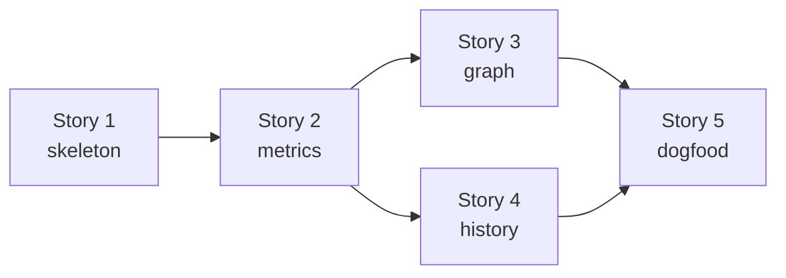

# Implementation Plan

All 14 iterations are implemented as of 2026-09-04. The measured result is in
[baseline.md](./baseline.md).

Iterations for the architecture in [architecture.md](./architecture.md). Each
iteration is self-contained, compiles on its own, and leaves one runnable
check behind. Stories group related iterations.

Testing uses `github.com/stretchr/testify`. Packages that read the file system
or run subprocesses take their input as a `fs.FS` or an `io.Reader` where that
costs nothing, so their tests need neither a real module nor a real repository.

## Story 1 — Walking Skeleton

### Iteration 1: module and root command

- `go.mod` (module path `github.com/ftl/go-depend`, current Go version), `.gitignore` entry for the binary
- `main.go` in the module root: calls `cmd.Execute()`, maps the returned error to an exit code (0 ok, 2 error)
- `cmd`: cobra root command with the long description from the README, no subcommands yet
- **Check**: root command executes and prints help without error
- **Done when**: `go build ./...` and `go-depend --help` work

### Iteration 2: the model

- `model`: package node (import path, module path, directory, exported type/func counts, abstract count), import edge with its classification (same-module, workspace-sibling, external, stdlib), and a graph holding the nodes plus forward and reverse edge lookups
- No behaviour beyond construction and lookup
- **Check**: unit test builds a small graph by hand and asserts forward and reverse lookups, including a package with no edges in either direction
- **Done when**: `metrics`, `graph` and `history` have a vocabulary to be written against

## Story 2 — Metrics and `scan`

### Iteration 3: loading the import graph

- `load`: patterns to `go/packages` (`NeedName|NeedFiles|NeedCompiledGoFiles|NeedModule|NeedSyntax`, `Tests: false`), build the `model` graph, classify every import
- `--exclude` regexes applied to module-relative file paths before parsing; a file list is enough at this stage
- Workspace handling: each package keeps its own module path, cross-module imports classify as external
- Refuse a package with load errors, naming it. Note: unresolved imports and
  type errors only surface once `NeedTypes` is requested, so this guard is
  limited to pattern and list errors until iteration 4
- Testdata: a fixture module under `load/testdata/module` (own `go.mod`, five packages, one generated-looking file), a workspace fixture under `load/testdata/workspace`, and `load/testdata/empty` without any Go file
- **Check**: load the fixture module, assert node set and per-package import classifications
- **Done when**: a full import graph is available for a real directory

### Iteration 4: declaration counting

- `load`: add `NeedTypes`, count exported named types and package-level funcs, mark the abstract ones (interfaces, type-parameterised types, type-parameterised funcs)
- With `NeedTypes` the refusal of packages that do not compile becomes effective; add a fixture module with an unresolved import to cover it
- Ignore methods, consts, vars and type aliases
- Extend the fixture with an interface, a generic type, a generic func, a plain struct, a named non-struct type, methods, consts, vars, an alias, and a package with no exported declarations
- **Check**: per-package expected counts over the fixture, table-driven
- **Done when**: the graph carries everything `A` needs

### Iteration 5: I, A, D

- `metrics`: `Ca`, `Ce` (same-module only), stdlib and external counts, `I`, `A` (`0` for an empty denominator), signed `A + I - 1`, `D`
- **Check**: table-driven tests on hand-built graphs — a leaf, a hub, a `main` package, an empty package, a package with only stdlib imports
- **Done when**: every number in the report exists

### Iteration 6: invariants

- `metrics`: per-edge stable-dependencies check (`I(dep) > I(pkg)`) returning the offending imports, and the zone check on the signed distance against a threshold, yielding none / pain / useless
- **Check**: table-driven tests, including a package with several violating edges and one exactly at the threshold
- **Done when**: violations are computable without any rendering

### Iteration 7: `scan` with the table renderer

- `report`: report row type and the aligned text renderer, sorted by module then package name; violation markers and the offending imports
- `cmd`: `scan` command with `[pattern ...]` (default `./...`), `--exclude`, `--max-distance`
- **Check**: renderer golden test on hand-built rows; command test asserting `scan` on the fixture produces a non-empty table
- **Done when**: the tool is useful end to end for the first time

### Iteration 8: JSON and CSV

- `report`: JSON and CSV renderers over the same row type, `--format table|json|csv`
- **Check**: golden tests for both; JSON round-trips into a map with the expected keys
- **Done when**: output is machine readable

### Iteration 9: exit codes

- `cmd`: `--fail-on-violation` → exit 1 when any row carries a violation; keep 2 for tool and usage errors
- **Check**: command tests for all three exit codes
- **Done when**: `scan` works as a CI gate

## Story 3 — `graph`

### Iteration 10: traversal

- `graph`: breadth-first traversal from the selected packages in the requested directions, depth limit with 0 meaning unlimited, nodes restricted to module packages, cycle-safe
- **Check**: table-driven tests on a hand-built graph — outgoing only, incoming only, both, depth 1 vs unlimited, a cycle, and a package that is its own only neighbour
- **Done when**: the node and edge subset for every README focus mode is computable

### Iteration 11: mermaid and the `graph` command

- `graph`: mermaid rendering, one subgraph per module, node ids sanitised from import paths, labels shortened module-relative
- `cmd`: `graph` command with `[pattern]` (default `.`), `--incoming`, `--outgoing` (neither given → both), `--depth`, `--output`, `--exclude`
- Open question for this iteration: the argument of `graph` is not always a
  load pattern. For the third focus the root is an external import path like
  `github.com/spf13/cobra`, which `go list` cannot resolve inside the module.
  The command therefore has to load the whole module and resolve its argument
  to a root import path afterwards.
- **Check**: golden test for the rendered mermaid; command test writing to a temp file
- **Done when**: all three README focus modes work from the command line

## Story 4 — Reality Check

### Iteration 12: git log parsing

- `history`: run `git log --name-status -M --pretty=...` in the module root, and a parser taking an `io.Reader` that yields commit timestamps with changed paths
- Rename chains: `R<score> old new` lines build a path map, historical paths rewrite to their current location
- **Check**: parser test on a captured `git log` fixture as a string — a plain commit, a rename, a rename of an already renamed path, a delete, a merge commit with no file list
- **Done when**: a per-package change timeline is available without touching a repository in tests

### Iteration 13: perceived instability

- `history`: bucket changes by month, `perceived_I` = active buckets / total buckets
- `cmd`: `--history` and `--since`; `report`: perceived instability and delta columns in all three renderers
- **Check**: bucketing unit tests — constant change → 1.0, one burst → low, no change → 0; renderer test for the extra columns
- **Done when**: the reality check from the README works

## Story 5 — Dogfood

### Iteration 14: run go-depend on go-depend

- Run `scan` and `graph` on this module, record the baseline output in [baseline.md](./baseline.md)
- Resolve the open points that the observed data answers: package display identity, and the accepted violation of `model`
- Fix what the numbers expose, if anything
- **Check**: the recorded baseline
- **Done when**: the tool measures itself and the open points are decided

`scan --fail-on-violation` exits with the code 1 on this module: `model` is in
the zone of pain, and that violation is accepted. A gate for the own CI needs
a decision that is not part of this iteration.

The reality check cannot measure this module, because its directory is no git
repository. The bucket size of one month therefore stays an open point.

## Notes

- Iterations 3 and 4 both touch `load`; they are split because iteration 3
  needs no type information and gives a working import graph on its own.
  Iteration 3 does request `NeedSyntax` after all: the imports have to be
  collected per file, otherwise `--exclude` could not remove the imports of
  an excluded file.
- Iterations 7, 11 and 13 are the only ones that add user-visible commands or
  columns. Everything before them is library work behind a compiling build.
- Story 3 and Story 4 are independent of each other and can be reordered.
